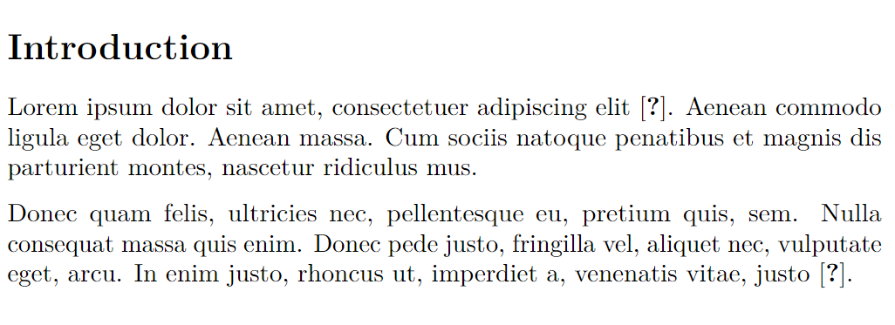

# pandoc-to-pdf

This repository reproduces a problem with Pandoc to PDF rendering when using a natbib bibliography.

If a PDF is generated directly like below references in the PDF are rendered as `[?]`.

```
pandoc example.md -s --natbib -o example.pdf
```



Additionally the abstract is using indent without margins to separate paragraphs, while regular text will use no indent and margins instead.


If the PDF is generated in two steps like below, references are rendered correctly. Paragraphs in abstract and regular text are still rendered differently, though.

```
pandoc example.md -s --natbib -t latex -o example.tex
latexmk -pdf example.tex
```
